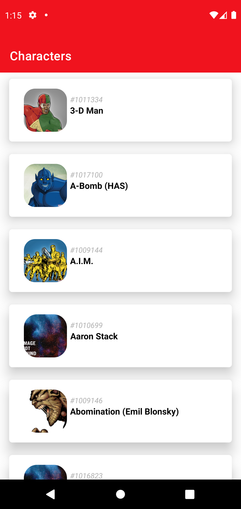
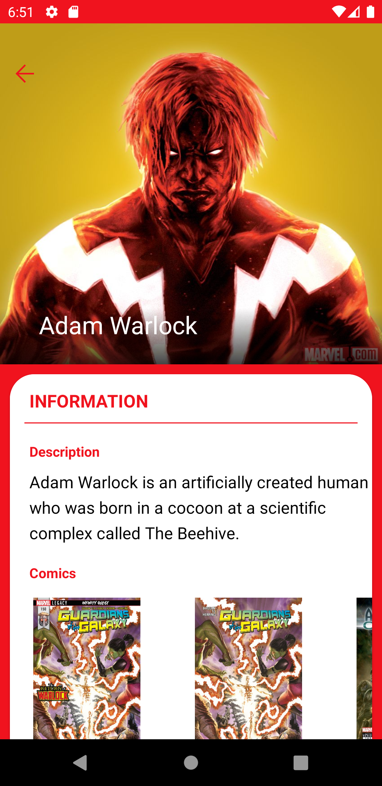

# Marvel API Test application:

Application to test the Marvel API, and test different libraries like the Jetpack Component suite.
Architecture approach inspired by DDD and CLEAN concepts.

## Screens 📱

The app currently consists of 2 screens:

- A list of characters screen, in which once the user enters de app, they can visualize a list of
  Marvel characters taken from the API, and select one.
- A character detail screen, in which after selecting one character from the list, the user can
  visualize detailed information from said character, like their name, description(if there is),
  comics or series.

## Libraries 🛠️

- [Flow](https://developer.android.com/kotlin/flow)
- [Dagger Hilt](https://dagger.dev/hilt/)
- [Coil](https://coil-kt.github.io/coil/)
- [Android Jetpack](https://developer.android.com/jetpack)
    - [Navigator](https://developer.android.com/guide/navigation/navigation-getting-started)
    - [View Binding](https://developer.android.com/topic/libraries/view-binding)
    - [ViewModel](https://developer.android.com/topic/libraries/architecture/viewmodel)
    - [Lifecycle](https://developer.android.com/topic/libraries/architecture/lifecycle)
- [Retrofit](https://square.github.io/retrofit/)
- [Moshi](https://github.com/square/moshi)
- [Lottie](https://github.com/airbnb/lottie-android/)

## Structure 🎨

Currently the app all sits in one single module App.

- __Data__: Contains the repositories Implementations and one or multiple Data Sources.
    - __Datasource__: In which we have the source of the data we are going to work with, let it be
      the API implementation and abstraction, and/or the database. In this case, we have the API
      calls. It's all separated by features.
    - __Repositories__: Repositories are responsible to coordinate data from the different Data
      Sources. A sort of abstraction for the data sources in order to avoid working directly with
      them. We make calls to them and we can ignore whether the data comes from the network or a
      local database.
- __DI__: The dependency injector package, where the modules and components are created.
- __Domain__: Collection of entity objects and related business logic that is designed to represent
  the enterprise business model.
    - __Models__: an abstraction of the objects that represent the logic of the project.
    - __Repository__: The abstraction of the repositories to be implemented in the Data package.
    - __UseCases__: the interactors that define be the business logic of the application.
- __UI__: with an MVVM pattern, everything is separated as features, the screens and logic behind
  them are found here.
- __Utils__: A variety of classes, extensions, and helpers to help and use across the application,
  that not necessarily have anything to do with the logic of the same.

## Testing 🧰

#### (There should totally be more tests, but because of the type of project, I haven't tested every part of the application. I decided to test the basic functionalities in the repositories, two useCases and the two viewModels since I felt it was representative enough. At least for the time being.)

- [Mockk](https://mockk.io/)
- [Kluent](https://markusamshove.github.io/Kluent/)

## Marvel API  Setup 

You'll need to create your own API keys
on [Marvel's developer site](https://developer.marvel.com/documentation/getting_started), check more
information on their website.

The API keys should be in the apikey.properties file in the root folder, you'll need to add the
values accordingly.

        MARVEL_API_BASE_URL="hthttps://gateway.marvel.com/v1/public/"
        MARVEL_API_PUBLIC_KEY="your public api"
        MARVEL_API_TS="MarvelApp"
        MARVEL_API_HASH="your md5(ts+privateKey+publicKey) hash"

## Screenshots

 

